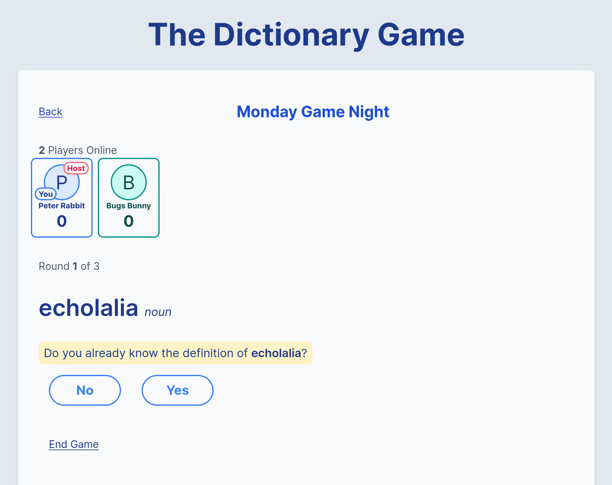
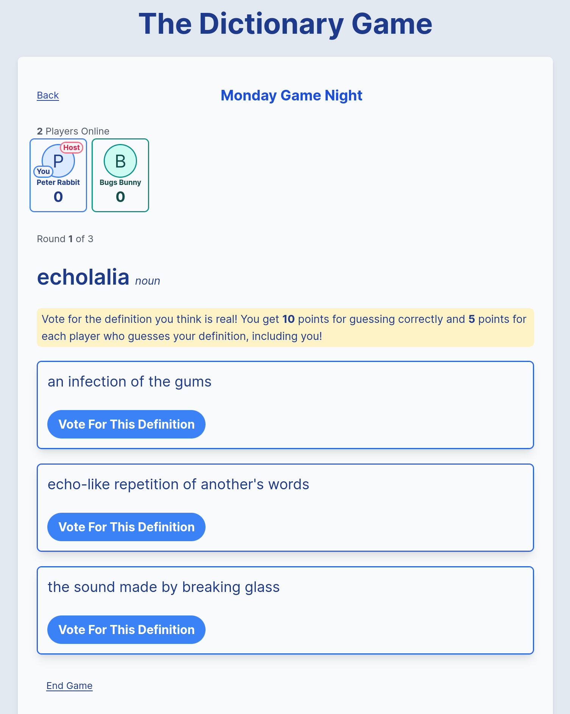
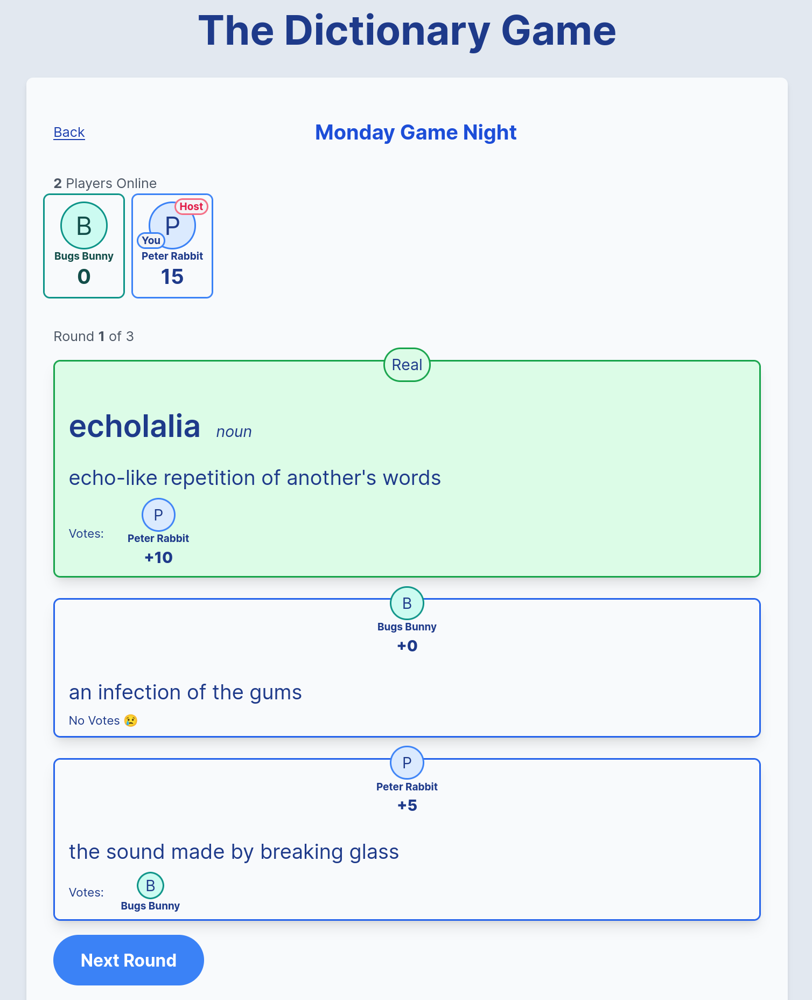

<h1 align="center">
    Dictionary Game 
</h1>

  <a href="https://dictionarygame.xyz/">Live Site</a> |
  <a href="#screenshots">Screenshots</a> |
  <a href="#running-locally">Running Locally</a> |
  <a href="#learn-more">Learn More</a>

## A multiplayer word game built with Elixir, Phoenix, LiveView and Tailwind CSS. You can try playing with a friend (or with yourself in separate browsers) [here](https://dictionarygame.xyz/).

## [Screenshots](screenshots)

  
   
  

## [Running Locally](running-locally)

- Install dependencies with `mix deps.get`
- Create and migrate your database with `mix ecto.setup`
- Start Phoenix endpoint with `mix phx.server` or inside IEx with `iex -S mix phx.server`

Now you can visit [`localhost:4000`](http://localhost:4000) from your browser.

## [Learn more about Phoenix](learn-more)

- Official website: https://www.phoenixframework.org/
- Guides: https://hexdocs.pm/phoenix/overview.html
- Docs: https://hexdocs.pm/phoenix
- Forum: https://elixirforum.com/c/phoenix-forum
- Source: https://github.com/phoenixframework/phoenix
